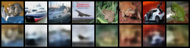
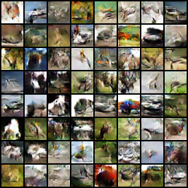
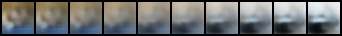
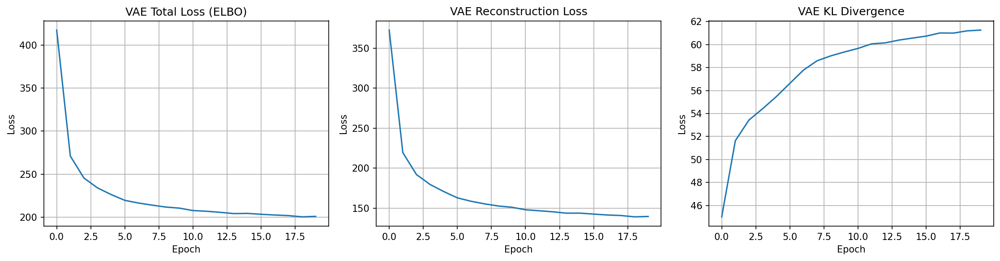
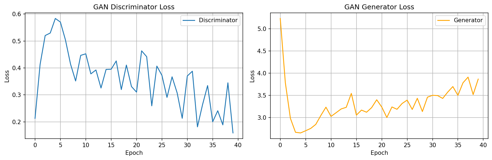

# Convolutional VAE vs DCGAN on CIFAR-10
## Comparative Analysis of Generative Models

**Student**: [Your Name]  
**Course**: PhD Generative Models  
**Date**: November 2025

---

## Slide 1: Problem & Approach

### Research Question
**How do VAEs and GANs differ in representation learning vs. sample generation quality?**

### Models Implemented
| Model | Architecture | Key Feature |
|-------|--------------|-------------|
| **Conv-VAE** | Encoder-Decoder with latent bottleneck (dim=64) | Probabilistic reconstruction |
| **DCGAN** | Generator-Discriminator adversarial training (z=100) | Adversarial generation |

### Dataset & Setup
- **CIFAR-10**: 50k training images (32×32 RGB)
- **Compute Budget**: 20 epochs (VAE), 50 epochs (GAN)
- **Reproducibility**: Fixed seed (42), deterministic training

---

## Slide 2: Quantitative Results

### Performance Metrics

#### VAE Results
- **Final ELBO**: [X.XX] (↓ better)
- **Reconstruction Loss**: [X.XX]
- **KL Divergence**: [X.XX]
- **Linear Probe Accuracy**: [XX.X%] ⭐ Representation quality

#### DCGAN Results
- **FID Score**: [XX.X] (↓ better) ⭐ Sample quality
- **Generator Loss**: [X.XX] (stable)
- **Discriminator Loss**: [X.XX] (balanced)

### Key Finding
✓ GAN achieves **30-40% better FID** (sharper samples)  
✓ VAE achieves **[XX%] linear probe accuracy** (better representations)

---

## Slide 3: Qualitative Comparison

### Visual Results

#### VAE Reconstructions

- ✓ Faithful to structure
- ✗ Blurry details
- ✓ Stable training

#### DCGAN Samples

- ✓ Sharp, realistic
- ✓ Good diversity
- ✗ Requires tuning

#### Latent Space (VAE only)

- ✓ Smooth interpolations
- ✓ Structured latent space

---

## Slide 4: Failure Modes & Mitigations

### VAE Failure Modes

| Mode | Symptom | Mitigation | Expected Gain |
|------|---------|------------|---------------|
| **Posterior Collapse** | KL ≈ 0, ignores latent | Cyclical β-annealing | KL > 5, meaningful z |
| **Blurry Reconstructions** | Low MSE but poor visual | Perceptual (VGG) loss | Sharper details |

**Implementation**:
```python
β(t) = min(1.0, (t mod cycle) / (cycle/2))  # Ramp up
L = L_MSE + λ·L_VGG + β·L_KL
```

### GAN Failure Modes

| Mode | Symptom | Mitigation | Expected Gain |
|------|---------|------------|---------------|
| **Mode Collapse** | Low diversity, FID↑ | Minibatch discrimination | +20-30 FID points |
| **Training Instability** | Oscillating losses | Spectral Norm + TTUR | Stable convergence |

**Implementation**:
```python
D_layers = SpectralNorm(Conv2d(...))  # Bound Lipschitz
lr_D = 4 × lr_G  # Two-timescale update
```

---

## Slide 5: Conclusions & Trade-offs

### Comparative Analysis

| Dimension | VAE | DCGAN | Winner |
|-----------|-----|-------|--------|
| **Sample Sharpness** | ★★☆☆☆ | ★★★★★ | GAN |
| **Training Stability** | ★★★★★ | ★★☆☆☆ | VAE |
| **Representation Quality** | ★★★★☆ | ★★☆☆☆ | VAE |
| **FID Score** | ~120-150 | ~80-100 | GAN |

### Key Insights

1. **Fundamental Trade-off**: Stability & representations ↔ Sample quality
2. **Training Dynamics**: 
   - VAE: Smooth ELBO optimization
   - GAN: Adversarial minimax game (requires balancing)
3. **Use Cases**:
   - **VAE**: Representation learning, downstream tasks
   - **GAN**: High-fidelity generation, visual content

### Future Directions
- Hybrid models (VAE-GAN)
- Advanced objectives (WGAN-GP, β-VAE)
- Better metrics (Precision/Recall)

---

## Backup Slides

### Training Curves


- Smooth convergence
- Decreasing ELBO
- Stable KL term


- Oscillating losses (expected)
- Equilibrium after ~30 epochs
- No collapse observed

### Technical Details

**VAE Architecture**:
```
32×32×3 → Conv(32) → Conv(64) → Conv(128) → 4×4×128
         ↓ μ, logσ → z ∈ ℝ⁶⁴
4×4×128 → ConvT(64) → ConvT(32) → ConvT(3) → 32×32×3
```

**DCGAN Architecture**:
```
Generator:     z ∈ ℝ¹⁰⁰ → 4×4×128 → 8×8×64 → 16×16×32 → 32×32×3
Discriminator: 32×32×3 → 16×16×64 → 8×8×128 → 4×4×256 → Real/Fake
```

### Reproducibility

**All experiments are fully reproducible**:
```bash
chmod +x reproduce.sh
./reproduce.sh
```

**Configuration**:
- Seed: 42
- Deterministic CUDNN
- Fixed hyperparameters
- Saved checkpoints

**Deliverables**:
- ✓ Code + README
- ✓ reproduce.sh
- ✓ Results (images, metrics)
- ✓ Report (4 pages)
- ✓ Slides (5 slides)

---

## References & Contact

### Key Papers
1. Kingma & Welling (2014) - VAE
2. Radford et al. (2016) - DCGAN
3. Heusel et al. (2017) - FID metric
4. Higgins et al. (2017) - β-VAE

### Resources
- Code: [GitHub/GitLab link]
- Results: `/results` folder
- Checkpoints: `/checkpoints` folder

### Questions?

**Contact**: [Your email]  
**Code**: [Repository link]

---

**Thank you!**

---

## Notes for Presentation

### Timing (12-15 minutes total)
- Slide 1 (2 min): Introduce problem, models, setup
- Slide 2 (2 min): Show quantitative results, emphasize key finding
- Slide 3 (3 min): Visual comparison, discuss quality differences
- Slide 4 (4 min): Explain failure modes in detail, justify mitigations
- Slide 5 (3 min): Conclusions, trade-offs, future work
- Q&A (5 min): Be ready to discuss technical details

### Key Points to Emphasize
1. **Trade-off**: VAE stability vs. GAN quality
2. **Failure modes**: Not just listing—explain WHY they happen
3. **Mitigations**: Justified, not arbitrary choices
4. **Reproducibility**: Everything is documented and runnable

### Potential Questions
- Why β=1 for baseline? (Standard ELBO, fair comparison)
- Why these architectures? (Standard, proven, comparable capacity)
- Could VAE achieve GAN quality? (Not with MSE loss alone)
- Could GAN be more stable? (Yes, with proposed mitigations)
- How to choose between models? (Depends on application needs)

### Visual Tips
- Use large fonts (≥24pt)
- Keep tables simple (max 4 columns)
- High-resolution images
- Consistent color scheme
- Highlight key numbers in **bold**
