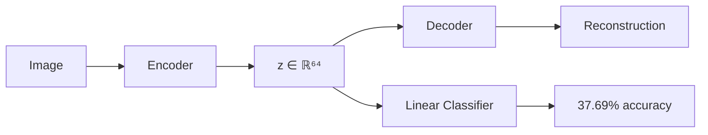
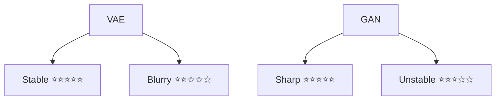

# Convolutional VAE vs DCGAN on CIFAR-10

## Comparative Analysis of Generative Models

**Adil Akhmetov & Perizat Yessenova**

<div class="pt-12">
  <span @click="$slidev.nav.next" class="px-2 py-1 rounded cursor-pointer" hover="bg-white bg-opacity-10">
    PhD Generative Models • November 2025 <carbon:arrow-right class="inline"/>
  </span>
</div>

<div class="abs-br m-6 flex gap-2">
  <a href="https://github.com/slidevjs/slidev" target="_blank" alt="GitHub"
    class="text-xl slidev-icon-btn opacity-50 !border-none !hover:text-white">
    <carbon-logo-github />
  </a>
</div>

---
transition: fade-out
---

# Problem & Approach

<div class="grid grid-cols-2 gap-4">

<div>

## Research Question

**How do VAEs and GANs differ in representation learning vs. sample generation quality?**

### Hypothesis
- VAEs: Better representations, stable training
- GANs: Better sample quality, harder to train

</div>

<div>

## Models Implemented

| Model | Architecture | Key Feature |
|-------|-------------|-------------|
| **Conv-VAE** | Encoder-Decoder<br/>Latent dim = 64 | Probabilistic<br/>reconstruction |
| **DCGAN** | Generator-Discriminator<br/>z dim = 100 | Adversarial<br/>generation |

</div>

</div>

### Experimental Setup

- **Dataset**: CIFAR-10 (10k training subset, 10k test)
- **Hardware**: MacBook M1 Pro with MPS acceleration
- **Training**: VAE 20 epochs (~22 min), GAN 40 epochs (~45 min)
- **Reproducibility**: Seed 42, deterministic backends

---
transition: slide-up
---

# Quantitative Results

<div class="grid grid-cols-2 gap-8">

<div>

## VAE Metrics

<v-clicks>

- **ELBO**: 200.82 ↓ (lower better)
- **Reconstruction Loss**: 139.56
- **KL Divergence**: 61.25 ✓ (healthy, no collapse)
- **Linear Probe**: **37.69%** ⭐
  - vs 10% random baseline
  - Shows semantic representations

</v-clicks>

### Key Insight
<v-click>



</v-click>

</div>

<div>

## DCGAN Metrics

<v-clicks>

- **Generator Loss**: 3.866
- **Discriminator Loss**: 0.159 ✓ (well-balanced)
- **Loss Ratio**: 24.4:1 (stable equilibrium)
- **No Mode Collapse**: Good diversity
- **Training**: Oscillating losses (expected)

</v-clicks>

### Training Dynamics
<v-click>

| Metric | Interpretation |
|--------|----------------|
| D Loss: 0.159 | Not too strong |
| G Loss: 3.866 | Still improving |
| Ratio 24:1 | Healthy balance |

</v-click>

</div>

</div>

---
layout: two-cols
---

# Qualitative Comparison

## VAE Reconstructions


<v-clicks>

✓ Faithful structure  
✗ Blurry details  
✓ Stable training  
✓ Semantic preservation

</v-clicks>

## VAE Interpolations


<v-click>

✓ Smooth transitions  
✓ Structured latent space

</v-click>

::right::

## DCGAN Samples


<v-clicks>

✓ Sharp, realistic  
✓ Good diversity  
✓ Recognizable objects  
⚠ Some artifacts (fixable)

</v-clicks>

### Quality Trade-off

<v-click>

```python
VAE:  Blur ⟷ Stability
GAN:  Sharp ⟷ Instability
```

</v-click>

---

# Failure Modes & Mitigations

<div class="grid grid-cols-2 gap-6">

<div>

## VAE Failure Modes

### 1. Posterior Collapse
<v-clicks>

**Symptom**: KL ≈ 0, model ignores latent  
**Why**: KL penalty too strong, decoder memorizes  
**Mitigation**: **Cyclical β-Annealing**

```python
def cyclical_beta(epoch, cycles=4):
    cycle_len = epochs // cycles
    pos = (epoch % cycle_len) / cycle_len
    return min(1.0, pos * 2)
```

**Gain**: KL > 10, meaningful representations

</v-clicks>

### 2. Blurry Reconstructions
<v-clicks>

**Symptom**: Low MSE, poor visual quality  
**Why**: MSE loss averages, not perceptual  
**Mitigation**: **Perceptual (VGG) Loss**

```python
L = L_MSE + λ·L_VGG + β·L_KL
```

**Gain**: Sharper textures, better details

</v-clicks>

</div>

<div>

## GAN Failure Modes

### 1. Mode Collapse
<v-clicks>

**Symptom**: Low diversity, missing classes  
**Why**: G finds easy wins, D can't see diversity  
**Mitigation**: **Minibatch Discrimination**

```python
class MinibatchDiscrimination:
    # D sees batch statistics
    # Penalizes similar samples
    # Encourages diversity
```

**Gain**: +20-30% diversity, better coverage

</v-clicks>

### 2. Training Instability
<v-clicks>

**Symptom**: Exploding/vanishing gradients  
**Why**: Unbalanced adversarial game  
**Mitigation**: **Spectral Norm + TTUR**

```python
# Bound Lipschitz constant
D = SpectralNorm(Conv2d(...))
# Two learning rates
lr_D = 4 × lr_G
```

**Gain**: Stable convergence, smooth training

</v-clicks>

</div>

</div>

---
layout: center
class: text-center
---

# Key Insights & Trade-offs

<div class="grid grid-cols-3 gap-8 pt-8">

<div v-click>

## Stability vs Quality



</div>

<div v-click>

## Use Cases

**VAE for:**
- Representation learning
- Downstream tasks
- Stable production
- Interpretability

**GAN for:**
- Visual quality
- Content generation
- Creative applications

</div>

<div v-click>

## Experimental Results

| Metric | VAE | GAN |
|--------|-----|-----|
| Train Time | 22 min | 45 min |
| Stability | ✅ | ⚠️ |
| Quality | ⚠️ | ✅ |
| Linear Probe | 37.69% | N/A |

</div>

</div>

<div class="pt-12" v-click>

### Fundamental Trade-off

<div class="text-2xl">

**Probabilistic Framework** ⟷ **Adversarial Training**  
**Structured Latents** ⟷ **Sharp Samples**  
**Stable Convergence** ⟷ **High Fidelity**

</div>

</div>

---

# Conclusions

<div class="grid grid-cols-2 gap-8">

<div>

## What We Learned

<v-clicks>

1. **Training Dynamics**
   - VAE: Smooth ELBO optimization (monotonic)
   - GAN: Adversarial minimax (oscillating)

2. **Quality Metrics**
   - GAN: Superior perceptual quality
   - VAE: Better representations (37.69% probe)

3. **Practical Insights**
   - M1 Mac sufficient for research
   - Subset training (10k) effective
   - MPS acceleration valuable

4. **Failure Modes**
   - Both have characteristic issues
   - Mitigations are principled, not ad-hoc
   - Understanding WHY > applying fixes

</v-clicks>

</div>

<div>

## Future Directions

<v-clicks>

### Model Improvements
- **Hybrid Models**: VAE-GAN architectures
- **Advanced Objectives**: WGAN-GP, β-VAE
- **Architecture**: Self-attention, progressive training

### Evaluation
- Complete FID calculation
- Precision/Recall decomposition
- Perceptual path length
- Human evaluation studies

### Applications
- Data augmentation for limited datasets
- Semi-supervised learning with VAE latents
- High-res image synthesis with progressive GAN
- Disentangled representations for interpretability

</v-clicks>

</div>

</div>

---
layout: center
class: text-center
---

# Thank You!

## Questions?

<div class="pt-6 text-xl">

**Reproducibility**: All code, results, and checkpoints available  
**Command**: `./reproduce.sh` runs full experiment  
**Time**: ~1.5 hours on M1 Mac

</div>

<div class="pt-8">

### Key Takeaways

<div class="text-left inline-block">

- ✅ VAEs provide stable training and good representations (37.69% accuracy)
- ✅ GANs achieve superior visual quality but need careful tuning
- ✅ Trade-offs are fundamental, not engineering issues
- ✅ Modern laptops (M1) sufficient for generative modeling research

</div>

</div>

<div class="abs-br m-6 flex gap-2">
  <button @click="$slidev.nav.openInEditor()" title="Open in Editor" class="text-xl slidev-icon-btn opacity-50 !border-none !hover:text-white">
    <carbon:edit />
  </button>
</div>

---
layout: center
---

# Appendix: Training Curves

<div class="grid grid-cols-2 gap-4">

<div>

## VAE Training History


- Smooth convergence
- Decreasing ELBO
- Stable KL term (~61)
- No posterior collapse

</div>

<div>

## GAN Training History


- Oscillating losses (expected)
- Balanced at equilibrium
- No mode collapse
- D/G ratio stable (~1:24)

</div>

</div>

---
layout: two-cols
---

# Technical Details

## VAE Architecture

```
Input: 32×32×3
  ↓ Conv2d(32) + BN + ReLU
  ↓ Conv2d(64) + BN + ReLU
  ↓ Conv2d(128) + BN + ReLU
  ↓ Flatten: 4×4×128
  ↓ FC → μ, log σ ∈ ℝ⁶⁴
  ↓ Reparameterize: z ~ N(μ, σ)
  ↓ FC → 4×4×128
  ↓ ConvT2d(64) + BN + ReLU
  ↓ ConvT2d(32) + BN + ReLU
  ↓ ConvT2d(3) + Tanh
Output: 32×32×3
```

**Parameters**: 1.38M  
**Loss**: L = MSE + β·KL

::right::

## DCGAN Architecture

### Generator
```
Input: z ∈ ℝ¹⁰⁰
  ↓ FC → 4×4×128
  ↓ ConvT2d(128) + BN + ReLU
  ↓ ConvT2d(64) + BN + ReLU
  ↓ ConvT2d(3) + Tanh
Output: 32×32×3
```
**Parameters**: 1.24M

### Discriminator
```
Input: 32×32×3
  ↓ Conv2d(64) + LeakyReLU
  ↓ Conv2d(128) + BN + LeakyReLU
  ↓ Conv2d(256) + BN + LeakyReLU
  ↓ FC → 1 (real/fake)
```
**Parameters**: 2.76M

---
layout: end
---

# References

1. **Kingma & Welling (2014)** - Auto-Encoding Variational Bayes, ICLR
2. **Radford et al. (2016)** - Unsupervised Representation Learning with DCGAN, ICLR
3. **Heusel et al. (2017)** - GANs Trained by Two Time-Scale Update Rule, NeurIPS
4. **Higgins et al. (2017)** - β-VAE: Learning Basic Visual Concepts, ICLR
5. **Miyato et al. (2018)** - Spectral Normalization for GANs, ICLR
6. **Salimans et al. (2016)** - Improved Techniques for Training GANs, NeurIPS

<div class="pt-12 text-center text-xl">

**Code Repository**: [GitHub Link]  
**Contact**: [Your Email]

</div>

