# Deep Q-Learning Projects

## Final Project Presentation

<div class="pt-12">
  <span class="px-2 py-1">
    🎮 Atari Breakout & 🚦 Traffic Light Control
  </span>
</div>

<div class="abs-br m-6 flex gap-2">
  <span class="text-sm opacity-50">PyTorch + Gymnasium</span>
</div>

---
layout: two-cols
---

# Project Overview

Two implementations of **Deep Q-Learning (DQN)**:

<v-clicks>

1. **Atari Breakout (1976)**
   - Classic arcade game
   - Visual input (CNN)
   - 4 discrete actions

2. **Traffic Light Control**
   - Real-world application
   - State-based input (MLP)
   - 2 discrete actions

</v-clicks>

::right::

<div class="pl-4">

## Core DQN Components

```mermaid
graph TD
    A[Agent] --> B[ε-greedy Policy]
    A --> C[Experience Replay]
    A --> D[Target Network]
    B --> E[Exploration vs Exploitation]
    C --> F[Break Correlations]
    D --> G[Stable Training]
```



</div>

---
layout: section
---

# Task 1: Atari Breakout
## Deep Q-Learning for Classic Gaming

---

# Breakout: Problem Definition

<div class="grid grid-cols-2 gap-4">
<div>

## Goal
Train an agent to play Breakout by breaking bricks with a ball

## Environment
- **Platform**: Gymnasium (BreakoutNoFrameskip-v4)
- **Original frame**: 210×160 RGB pixels
- **Reward**: +1 per brick destroyed
- **Episode ends**: When ball is missed

</div>
<div>

## Actions (4 total)

| Action | Description |
|--------|-------------|
| NOOP | Do nothing |
| FIRE | Launch ball |
| LEFT | Move paddle left |
| RIGHT | Move paddle right |

</div>
</div>

---

# State Preprocessing Pipeline

<div class="grid grid-cols-2 gap-8">
<div>

## Transformations

```python
# 1. Convert to grayscale
grayscale_obs=True

# 2. Resize to 84×84
screen_size=84

# 3. Frame skip (4 frames)
frame_skip=4

# 4. Stack 4 frames
FrameStackObservation(env, stack_size=4)
```

</div>
<div>

## Why Stack Frames?

<v-clicks>

- Single frame → **no motion information**
- Ball direction is unknown
- Ball speed is unknown

**Solution**: Stack 4 consecutive frames
- Shape: `(4, 84, 84)`
- Agent "sees" temporal dynamics

</v-clicks>

</div>
</div>

---

# CNN Architecture

```python {all|3-5|8|11-12|all}
class DQN_CNN(nn.Module):
    def __init__(self, input_channels=4, num_actions=4):
        # Convolutional layers
        self.conv1 = nn.Conv2d(input_channels, 32, kernel_size=8, stride=4)
        self.conv2 = nn.Conv2d(32, 64, kernel_size=4, stride=2)
        self.conv3 = nn.Conv2d(64, 64, kernel_size=3, stride=1)
        
        # Input: 84x84 → conv1: 20x20 → conv2: 9x9 → conv3: 7x7
        
        # Fully connected layers
        self.fc1 = nn.Linear(64 * 7 * 7, 512)
        self.fc2 = nn.Linear(512, num_actions)  # Output: Q-values
```

<div class="mt-4">

| Layer | Input | Output | Parameters |
|-------|-------|--------|------------|
| Conv1 | 4×84×84 | 32×20×20 | 8,224 |
| Conv2 | 32×20×20 | 64×9×9 | 32,832 |
| Conv3 | 64×9×9 | 64×7×7 | 36,928 |
| FC1 | 3136 | 512 | 1,606,144 |
| FC2 | 512 | 4 | 2,052 |

</div>

---

# Experience Replay Buffer

<div class="grid grid-cols-2 gap-4">
<div>

## Implementation

```python
class ReplayBuffer:
    def __init__(self, capacity=100000):
        self.buffer = deque(maxlen=capacity)
    
    def push(self, state, action, reward, 
             next_state, done):
        self.buffer.append(
            (state, action, reward, 
             next_state, done)
        )
    
    def sample(self, batch_size):
        batch = random.sample(
            self.buffer, batch_size
        )
        return zip(*batch)
```

</div>
<div>

## Why Experience Replay?

<v-clicks>

1. **Breaks correlation** between consecutive samples
2. **Reuses** past experiences efficiently
3. **Stabilizes** training

### Configuration
- Buffer size: **100,000** transitions
- Batch size: **32**
- Warmup: 10,000 steps before training

</v-clicks>

</div>
</div>

---

# ε-Greedy Exploration

<div class="grid grid-cols-2 gap-4">
<div>

## Strategy

$$
a = \begin{cases}
\text{random action} & \text{with probability } \varepsilon \\
\arg\max_a Q(s, a) & \text{with probability } 1 - \varepsilon
\end{cases}
$$

## Decay Schedule

```python
epsilon = epsilon_end + 
    (epsilon_start - epsilon_end) * 
    max(0, 1 - steps / epsilon_decay)
```

</div>
<div>

## Parameters

| Parameter | Value |
|-----------|-------|
| ε start | 1.0 |
| ε end | 0.01 |
| Decay steps | 100,000 |

<div class="mt-4">

```
ε: 1.0 ━━━━━━━━━╲
                 ╲
                  ╲━━━━━━━━ 0.01
    0         100K        steps
```

</div>

</div>
</div>

---

# Target Network

<div class="grid grid-cols-2 gap-4">
<div>

## The Problem

Without target network:
- Q-values are **moving targets**
- Training becomes **unstable**
- "Chasing a moving goal"

## The Solution

Separate **target network** updated periodically:

```python
# Every 1000 steps
target_net.load_state_dict(
    policy_net.state_dict()
)
```

</div>
<div>

## Q-Learning Update

$$
Q(s, a) \leftarrow r + \gamma \max_{a'} Q_{\text{target}}(s', a')
$$

```python
# Compute target Q values
with torch.no_grad():
    next_q = target_net(next_states)
    max_next_q = next_q.max(dim=1)[0]
    target_q = rewards + gamma * max_next_q * (1 - dones)

# Compute loss
loss = F.smooth_l1_loss(current_q, target_q)
```

</div>
</div>

---

# Breakout Hyperparameters

<div class="grid grid-cols-2 gap-8">
<div>

## Training Configuration

| Parameter | Value |
|-----------|-------|
| Learning Rate | 2.5×10⁻⁴ |
| Discount (γ) | 0.99 |
| Batch Size | 32 |
| Buffer Size | 100,000 |
| Target Update | Every 1000 steps |
| Optimizer | Adam |
| Loss Function | Smooth L1 (Huber) |

</div>
<div>

## Training Scale

| Parameter | Value |
|-----------|-------|
| Episodes | 5,000 - 10,000 |
| Steps per episode | Up to 10,000 |
| Warmup steps | 10,000 |
| Gradient clipping | 10 |

### Estimated Training Time
- GPU: 4-8 hours
- CPU: 24-48 hours

</div>
</div>

---
layout: section
---

# Task 2: Traffic Light Control
## Adaptive DQN for Real-World Application

---

# Traffic Control: Problem Definition

<div class="grid grid-cols-2 gap-4">
<div>

## Intersection Setup

```
        │ NS │
        │ ↓↑ │
────────┼────┼────────
  WE →  │    │  ← WE
────────┼────┼────────
        │ ↓↑ │
        │ NS │
```

**Two directions**: NS (North-South), WE (West-East)

</div>
<div>

## Traffic Light Phases

| Phase | NS | WE |
|-------|----|----|
| **0** | 🟢 Green | 🔴 Red |
| **1** | 🔴 Red | 🟢 Green |

### Goal
Minimize queue lengths by **adaptive** phase selection

</div>
</div>

---

# TrafficEnv: Custom Environment

```python {all|2-5|7-10|12-15|17-20|all}
class TrafficEnv:
    # State: [queue_NS, queue_WE, phase]
    def _get_state(self):
        return np.array([self.queue_ns, self.queue_we, self.phase])
    
    # Dynamics: each step
    def step(self, action):
        # 1. Update phase
        switching = (action != self.phase)
        self.phase = action
        
        # 2. Cars pass on green (up to 3)
        if self.phase == 0:  # NS green
            self.queue_ns -= min(self.queue_ns, 3)
        else:  # WE green
            self.queue_we -= min(self.queue_we, 3)
        
        # 3. New cars arrive (Poisson process)
        self.queue_ns += np.random.poisson(1.2)
        self.queue_we += np.random.poisson(0.8)
        
        # 4. Calculate reward
        reward = -(self.queue_ns + self.queue_we)
        if switching:
            reward -= 0.5  # Penalty for switching
```

---

# DQN Network for Traffic Control

<div class="grid grid-cols-2 gap-4">
<div>

## Simple MLP Architecture

```python
class DQN_FC(nn.Module):
    def __init__(self, 
                 input_size=3, 
                 hidden_size=64, 
                 num_actions=2):
        self.net = nn.Sequential(
            nn.Linear(input_size, hidden_size),
            nn.ReLU(),
            nn.Linear(hidden_size, hidden_size),
            nn.ReLU(),
            nn.Linear(hidden_size, hidden_size),
            nn.ReLU(),
            nn.Linear(hidden_size, num_actions)
        )
```

</div>
<div>

## Network Structure

```
Input (3)
    │
    ▼
Linear → ReLU (64)
    │
    ▼
Linear → ReLU (64)
    │
    ▼
Linear → ReLU (64)
    │
    ▼
Linear (2)  ← Q-values
```

**Total parameters**: ~9,000

</div>
</div>

---

# Traffic Control Hyperparameters

<div class="grid grid-cols-2 gap-4">
<div>

## Agent Configuration

| Parameter | Value |
|-----------|-------|
| Learning Rate | 1×10⁻³ |
| Discount (γ) | 0.99 |
| Batch Size | 64 |
| Buffer Size | 10,000 |
| Target Update | Every 100 steps |
| Hidden Size | 64 |

</div>
<div>

## Training Configuration

| Parameter | Value |
|-----------|-------|
| Episodes | 500 |
| Steps per episode | 200 |
| ε start | 1.0 |
| ε end | 0.01 |
| ε decay | 3,000 steps |
| Switch penalty | 0.5 |

</div>
</div>

---

# Training Results

<div class="grid grid-cols-2 gap-4">
<div>

## Training Progress

```
Episode  50: Reward=-876, Queue=4.10, ε=0.046
Episode 100: Reward=-723, Queue=3.35, ε=0.011
Episode 150: Reward=-734, Queue=3.41, ε=0.010
Episode 200: Reward=-745, Queue=3.43, ε=0.010
Episode 300: Reward=-741, Queue=3.44, ε=0.010
Episode 400: Reward=-747, Queue=3.46, ε=0.010
Episode 500: Reward=-735, Queue=3.42, ε=0.010
```

</div>
<div>

## Learning Curve

```
Reward
  │
-700├────────────────────●●●●●
    │               ●●●●
-800├          ●●●●
    │      ●●●
-900├   ●●
    │  ●
    └──┬──┬──┬──┬──┬──┬──→ Episode
       0  100 200 300 400 500
```

Agent learns to maintain **low queue lengths** (~3.4 cars avg)

</div>
</div>

---

# Comparison: DQN vs Fixed Timing

<div class="grid grid-cols-2 gap-4">
<div>

## Experimental Results

| Controller | Avg Reward | Avg Queue |
|------------|-----------|-----------|
| Fixed (5 steps) | -1,393.76 | 6.87 |
| Fixed (10 steps) | -2,111.30 | 10.51 |
| Fixed (15 steps) | -2,835.30 | 14.14 |
| Fixed (20 steps) | -3,561.42 | 17.78 |
| **DQN Agent** | **-690.36** | **3.16** |

</div>
<div>

## Key Findings

<v-clicks>

### 🏆 DQN Improvement: **50.5%**
Over best fixed-timing controller

### Why DQN Wins
1. **Adapts** to current traffic conditions
2. **Predicts** future queue buildup
3. **Balances** both directions dynamically

### Fixed Timing Problems
- Cannot adapt to traffic variations
- Either too fast or too slow switching

</v-clicks>

</div>
</div>

---

# Performance Visualization

```
Queue Length Comparison
          │
      20 ─┤                           ████
          │                     ████  ████
      15 ─┤               ████  ████  ████
          │         ████  ████  ████  ████
      10 ─┤   ████  ████  ████  ████  ████
          │   ████  ████  ████  ████  ████
       5 ─┤   ████  ████  ████  ████  ████
          │   ████  ████  ████  ████  ████
       3 ─┤██ ████  ████  ████  ████  ████
          └──┴────┴─────┴─────┴─────┴─────┴──
             DQN  Fix-5 Fix-10 Fix-15 Fix-20

   ██ DQN Agent (Best Performance)
   ████ Fixed Timing Controllers
```

**DQN reduces average queue by 54%** compared to best fixed timing!

---
layout: two-cols
---

# Key DQN Components Summary

## 1. Experience Replay
- Stores transitions in buffer
- Random sampling breaks correlations
- Enables sample reuse

## 2. Target Network
- Separate network for Q-targets
- Periodic updates (every N steps)
- Stabilizes training

::right::

<div class="pl-4">

## 3. ε-Greedy Policy
- Balances exploration/exploitation
- Decays over time
- Ensures sufficient exploration

## 4. Neural Network
- **CNN** for visual input (Breakout)
- **MLP** for state vectors (Traffic)
- Outputs Q-values for all actions

</div>

---

# Implementation Highlights

<div class="grid grid-cols-2 gap-4">
<div>

## Technologies Used

- **PyTorch** - Deep learning framework
- **Gymnasium** - RL environments
- **NumPy** - Numerical computing
- **Matplotlib** - Visualization

## Code Quality

- Type hints throughout
- Modular class design
- Configurable hyperparameters
- Model save/load functionality

</div>
<div>

## Project Structure

```
pf/
├── final_project.ipynb
│   ├── Task 1: Breakout DQN
│   │   ├── DQN_CNN
│   │   ├── ReplayBuffer
│   │   ├── DQNAgent
│   │   └── Training loop
│   │
│   └── Task 2: Traffic Control
│       ├── TrafficEnv
│       ├── DQN_FC
│       ├── TrafficDQNAgent
│       └── Comparison analysis
│
└── presentation.md
```

</div>
</div>

---
layout: center
class: text-center
---

# Conclusions

<div class="grid grid-cols-2 gap-8 text-left mt-8">
<div>

## Task 1: Breakout
- ✅ CNN architecture implemented
- ✅ Frame preprocessing pipeline
- ✅ DQN with all components
- ✅ Ready for 5-10K episode training

</div>
<div>

## Task 2: Traffic Control
- ✅ Custom environment created
- ✅ DQN agent trained (500 episodes)
- ✅ **50.5% improvement** over baseline
- ✅ Adaptive behavior demonstrated

</div>
</div>

<div class="mt-12">

### 🎯 DQN successfully applied to both visual and state-based RL problems!

</div>

---
layout: end
---

# Thank You!

## Questions?

<div class="mt-8">

**Repository**: `pf/final_project.ipynb`

**Key Results**:
- Breakout: Full DQN implementation with CNN
- Traffic: 50.5% improvement over fixed timing

</div>
